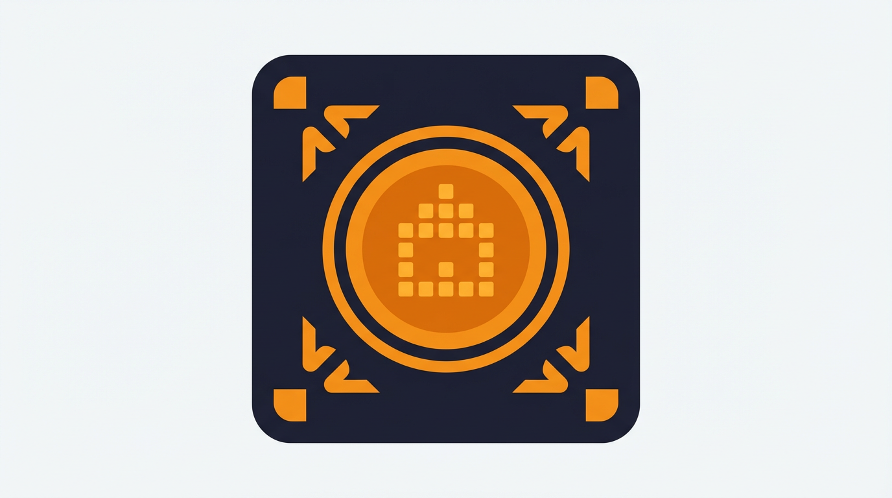

<p align="center">
  
</p>

<h1 align="center">Carrom Ulanzi Display</h1>

<p align="center">
  Home Assistant Integration — Carrom-Spielstände auf dem Ulanzi/Awtrix Pixel-Display
</p>

<p align="center">
  <a href="https://github.com/it00x32/ha-carrom-ulanzi/releases"></a>
  <a href="https://github.com/hacs/integration"></a>
  <a href="https://github.com/it00x32/ha-carrom-ulanzi/blob/main/LICENSE"></a>
</p>

---

## Features

- **Lauftext** mit aktuellen Spielerständen auf dem Awtrix-Display
- **Farbig**: Führender Spieler grün, Rest weiß, Rundeninfo orange
- **Regenbogen-Modus** optional aktivierbar
- **Gewinner-Benachrichtigung** als Awtrix-Notification bei Spielende
- **Pause-Erkennung**: Display-App wird bei Spielpause automatisch entfernt
- **Lifetime**: App verschwindet nach 120s ohne Update vom Display
- Alle Einstellungen (URL, Farben, Geschwindigkeit, Icon) in der HA-Oberfläche konfigurierbar

## Voraussetzungen

- Home Assistant **2024.1.0+**
- **MQTT-Integration** in HA eingerichtet und verbunden
- **Awtrix 3** Firmware (≥ 0.90) auf dem Ulanzi-Display, per MQTT verbunden
- Firebase Realtime Database URL mit Carrom-Livedaten

---

## Installation über HACS

### 1. Repository zu HACS hinzufügen

1. In Home Assistant: **HACS** → **Integrationen** öffnen
2. Oben rechts auf die **drei Punkte** (⋮) klicken → **Benutzerdefinierte Repositories**
3. Im Dialog eintragen:
   - **Repository:** `https://github.com/it00x32/ha-carrom-ulanzi`
   - **Kategorie:** `Integration`
4. **Hinzufügen** klicken

### 2. Integration installieren

1. In HACS → Integrationen nach **"Carrom Ulanzi Display"** suchen
2. **Herunterladen** klicken und die gewünschte Version wählen
3. **Home Assistant neu starten**

### 3. Integration einrichten

1. **Einstellungen** → **Geräte & Dienste** → **Integration hinzufügen**
2. Nach **"Carrom Ulanzi Display"** suchen und auswählen
3. Folgende Felder ausfüllen:

| Feld | Beschreibung |
|------|-------------|
| **Firebase URL** | Standard: `https://carrom-scorekeeper-default-rtdb.europe-west1.firebasedatabase.app/live_api.json` |
| **Awtrix MQTT-Prefix** | Der MQTT-Topic-Prefix deines Awtrix-Geräts (z.B. `awtrix_a1b2c3`) |
| **Abfrageintervall** | Wie oft die Daten abgefragt werden (Standard: 30s) |

---

## Manuelle Installation

1. Den Ordner `custom_components/carrom_ulanzi/` in dein HA-Verzeichnis `config/custom_components/` kopieren
2. Home Assistant neu starten
3. Integration wie oben beschrieben einrichten

---

## Optionen

Nach der Einrichtung unter **Einstellungen** → **Geräte & Dienste** → **Carrom Ulanzi Display** → **Konfigurieren**:

| Option | Standard | Beschreibung |
|--------|----------|--------------|
| Firebase URL | `…/live_api.json` | Datenquelle (änderbar) |
| MQTT-Prefix | `awtrix` | Topic-Prefix des Awtrix-Geräts |
| App-Name | `carrom` | Name der Custom App auf dem Display |
| Abfrageintervall | 30s | Polling-Frequenz (5–3600s) |
| Scrollgeschwindigkeit | 100% | Awtrix Scroll-Speed |
| Anzeigedauer | 15s | Wie lange die App pro Zyklus angezeigt wird |
| Textfarbe | `FFFFFF` | Hex-Farbe für normale Spieler |
| Farbe Führender | `00FF00` | Hex-Farbe für den führenden Spieler |
| Farbe Runde | `FFAA00` | Hex-Farbe für die Rundenanzeige |
| Regenbogen | Aus | Regenbogen-Textfarben statt Einzelfarben |
| Icon | *(leer)* | Awtrix-Icon-Name oder -ID |

## Entities

| Entity | Typ | Beschreibung |
|--------|-----|-------------|
| `sensor.carrom_display_status` | Sensor | OK / Pausiert / Fehler / Warte auf Daten |
| `sensor.carrom_letztes_update` | Sensor | Timestamp des letzten Daten-Updates |

Der Status-Sensor hat zusätzliche Attribute: `game_id`, `rounds_played`, `target`, `mode`, `source_url`.

---

## Display-Ausgabe

Beispiel mit Live-Daten:

```
Thomas: 60 | Flo: 77 | Thömse: 29  (Runde 11)
```

- **Flo: 77** → grün (Führender)
- **Thomas: 60**, **Thömse: 29** → weiß
- **(Runde 11)** → orange

Bei Spielende erscheint eine Notification:

```
Flo gewinnt mit 77 Punkten!
```

## Datenformat

Die Firebase-URL muss ein JSON-Objekt in diesem Format liefern:

```json
{
  "game_id": "C-9180",
  "is_paused": false,
  "last_update": 1774379963845,
  "mode": 3,
  "names": ["Thomas", "Flo", "Thömse"],
  "rounds_played": 11,
  "scores": [60, 77, 29],
  "target": "77"
}
```

---

## Versionierung

Die Version wird in `manifest.json` gepflegt. Bei einem neuen Release:

```bash
git tag v1.0.1
git push origin v1.0.1
```

Die GitHub Action erstellt automatisch ein Release mit der korrekten Versionsnummer und einem HACS-kompatiblen ZIP.

## Lizenz

MIT
